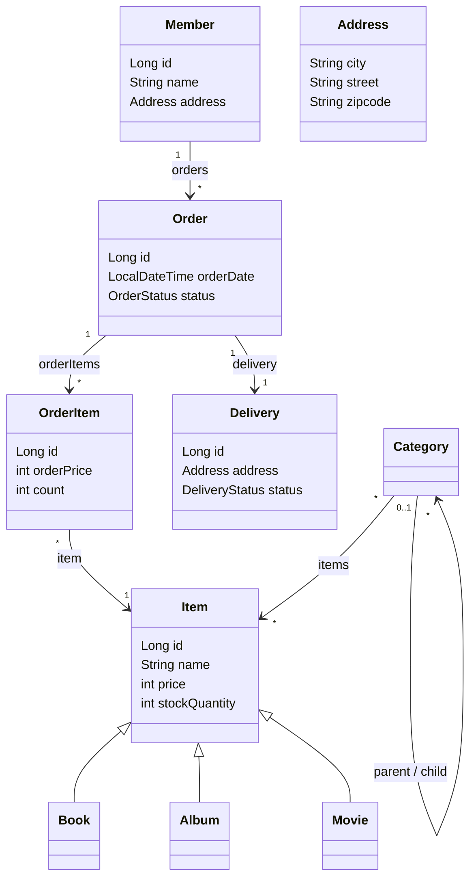

# 02. 도메인 분석 및 설계 — jpashop 도메인 모델

> 강의자료 `Spring Boot 와 JPA 활용 - 1/2. 도메인 분석 설계.pdf` 기반
> 스프링 부트 3.x / JPA `jakarta.persistence` 기준 정리

---

## 1. 요구사항 분석

### 기능

- 회원 기능: 회원 등록, 회원 조회
- 상품 기능: 상품 등록, 상품 수정, 상품 조회
- 주문 기능: 상품 주문, 주문 내역 조회, 주문 취소
- 기타 요구사항: 상품은 재고 관리가 필요하고, 상품 종류는 도서·음반·영화로 나뉜다. 주문 시 배송 정보를 저장한다.

### 핵심 관계

- 회원은 여러 주문을 할 수 있다. 주문은 한 명의 회원에게 속한다.
- 한 주문에는 여러 상품이 담길 수 있고, 하나의 상품은 여러 주문상품에 포함될 수 있다. 따라서 `Order`와 `Item`은 `OrderItem`으로 연결한다.
- 주문 하나에는 배송 정보 하나가 연결된다.
- 상품과 카테고리는 다대다 관계이며, 카테고리는 부모·자식 구조를 가진다.

---

## 2. 객체 모델



| 구성요소 | 책임과 주요 상태 |
| --- | --- |
| `Member` | 회원 이름, 주소, 주문 목록을 가진다. |
| `Order` | 주문 회원, 주문상품 목록, 배송, 주문 시각, 주문 상태를 가진다. |
| `OrderItem` | 주문 당시의 상품, 주문 가격, 수량을 가진다. 상품 가격이 바뀌어도 과거 주문 금액을 보존한다. |
| `Item` | 공통 상품 정보(이름·가격·재고)를 가진 추상 엔티티다. `Book`, `Album`, `Movie`가 상속한다. |
| `Delivery` | 배송지와 배송 상태를 가진다. |
| `Category` | 상품 분류와 부모·자식 카테고리 구조를 표현한다. |
| `Address` | 도시, 도로명, 우편번호를 묶은 값 타입이다. 회원과 배송에서 재사용한다. |

### 주문과 주문상품을 분리하는 이유

주문은 여러 상품을 담고, 상품도 여러 주문에 포함된다. 단순한 다대다 관계로 보이지만 주문 수량과 주문 당시 가격이라는 추가 정보가 필요하다. 이 정보의 주체인 `OrderItem`을 별도 엔티티로 두면 주문 이력을 정확히 보존하고 이후 할인 금액 같은 속성도 자연스럽게 확장할 수 있다.

---

## 3. 테이블 설계와 객체 설계의 연결

강의 슬라이드에서는 객체와 테이블을 구분하기 위해 대문자 이름을 사용하지만, 현재 프로젝트의 스프링 부트 기본 물리 명명 전략에서는 자바의 카멜 케이스가 소문자 + 밑줄 형식으로 변환된다. 예를 들어 `stockQuantity`는 `stock_quantity`가 된다.

| 객체 | 테이블 | 핵심 키 |
| --- | --- | --- |
| `Member` | `member` | `member_id` |
| `Order` | `orders` | `order_id`, `member_id`, `delivery_id` |
| `OrderItem` | `order_item` | `order_item_id`, `order_id`, `item_id` |
| `Item` 계층 | `item` | `item_id`, `dtype` |
| `Delivery` | `delivery` | `delivery_id` |
| `Category` | `category` | `category_id`, `parent_id` |

> `ORDER`는 데이터베이스에서 예약어로 취급될 수 있어 테이블 이름을 `orders`로 지정한다.

### 연관관계의 주인

외래 키를 관리하는 쪽을 연관관계의 주인으로 둔다. 객체 그래프에서 어느 쪽이 더 중요해 보이는지가 기준이 아니다.

| 관계 | 주인 | 외래 키 | 매핑 방향 |
| --- | --- | --- |
| 회원 - 주문 | `Order.member` | `orders.member_id` | 양방향 |
| 주문 - 주문상품 | `OrderItem.order` | `order_item.order_id` | 양방향 |
| 주문상품 - 상품 | `OrderItem.item` | `order_item.item_id` | 단방향 |
| 주문 - 배송 | `Order.delivery` | `orders.delivery_id` | 양방향 |
| 카테고리 - 상품 | `Category.items` | `category_item` | 다대다 예시 |

> 실무에서는 `@ManyToMany`를 직접 쓰지 않는다. 중간 테이블에 생성일·정렬 순서 등 추가 컬럼이 필요해지면 대응할 수 없으므로, `CategoryItem` 같은 연결 엔티티를 만들고 `@ManyToOne` 두 개로 풀어낸다.

---

## 4. 엔티티 구현 기준

### 공통 규칙

- 스프링 부트 3.x에서는 `javax.persistence`가 아니라 `jakarta.persistence`를 import한다.
- 식별자 필드는 객체에서는 짧게 `id`로 두고, DB 컬럼명은 `@Column(name = "member_id")`처럼 명시한다.
- 엔티티와 임베디드 값 타입에는 JPA가 사용할 기본 생성자가 필요하다. 외부 생성은 막기 위해 `protected`로 둔다.
- 엔티티의 변경은 무분별한 setter 대신 의미 있는 메서드로 표현한다. 예: `changeAddress()`, `cancel()`, `addStock()`.
- 양방향 관계는 연관관계 편의 메서드 한 곳에서 양쪽을 함께 설정한다.

### 주문 엔티티의 연관관계 편의 메서드

```java
@Entity
@Table(name = "orders")
@Getter
public class Order {

    @Id @GeneratedValue
    @Column(name = "order_id")
    private Long id;

    @ManyToOne(fetch = FetchType.LAZY)
    @JoinColumn(name = "member_id")
    private Member member;

    @OneToMany(mappedBy = "order", cascade = CascadeType.ALL)
    private List<OrderItem> orderItems = new ArrayList<>();

    @OneToOne(fetch = FetchType.LAZY, cascade = CascadeType.ALL)
    @JoinColumn(name = "delivery_id")
    private Delivery delivery;

    public void setMember(Member member) {
        this.member = member;
        member.getOrders().add(this);
    }

    public void addOrderItem(OrderItem orderItem) {
        orderItems.add(orderItem);
        orderItem.setOrder(this);
    }

    public void setDelivery(Delivery delivery) {
        this.delivery = delivery;
        delivery.setOrder(this);
    }
}
```

`Order`를 저장할 때 주문상품과 배송도 함께 생명주기를 관리한다면 `cascade = CascadeType.ALL`이 적절하다. 반대로 다른 화면이나 도메인에서도 독립적으로 관리하는 엔티티에는 무조건 cascade를 적용하면 안 된다.

### 상품 상속 전략

```java
@Entity
@Inheritance(strategy = InheritanceType.SINGLE_TABLE)
@DiscriminatorColumn(name = "dtype")
@Getter
public abstract class Item {
    @Id @GeneratedValue
    @Column(name = "item_id")
    private Long id;
    private String name;
    private int price;
    private int stockQuantity;
}

@Entity
@DiscriminatorValue("B")
public class Book extends Item {
    private String author;
    private String isbn;
}
```

`SINGLE_TABLE` 전략은 `item` 테이블 하나에 모든 상품 타입을 저장하고 `dtype` 컬럼으로 타입을 구분한다. 조회 시 조인이 필요 없고 단순하지만, 하위 타입 전용 컬럼은 다른 타입의 행에서 `null`이 될 수 있다.

### 상태는 문자열 enum으로 저장

```java
@Enumerated(EnumType.STRING)
private OrderStatus status; // ORDER, CANCEL
```

`EnumType.ORDINAL`은 enum 선언 순서가 바뀌면 기존 데이터의 의미가 달라질 수 있다. 상태 값은 항상 `EnumType.STRING`으로 저장한다. 배송 상태도 `READY`, `COMP` 같은 별도 `DeliveryStatus` enum으로 표현한다.

### 값 타입 `Address`

```java
@Embeddable
@Getter
public class Address {
    private String city;
    private String street;
    private String zipcode;

    protected Address() {
    }

    public Address(String city, String street, String zipcode) {
        this.city = city;
        this.street = street;
        this.zipcode = zipcode;
    }
}
```

값 타입은 식별자가 없고 속성 전체가 의미를 갖는다. 여러 엔티티에서 공유해 변경하면 안 되므로 setter를 제공하지 않고, 값이 바뀌면 새 `Address` 인스턴스로 교체하는 불변 객체 방식으로 사용한다.

---

## 5. 성능과 안전성 주의사항

### 모든 연관관계는 지연 로딩을 기본으로

`@ManyToOne`, `@OneToOne`은 기본이 즉시 로딩(EAGER)이므로 반드시 `fetch = FetchType.LAZY`를 명시한다. 즉시 로딩은 어떤 SQL이 실행될지 예측하기 어렵고 JPQL 조회 시 N+1 문제를 만들기 쉽다.

연관 엔티티를 한 번에 조회해야 할 때는 매핑을 EAGER로 바꾸지 말고, 조회 쿼리에서 fetch join 또는 엔티티 그래프를 선택적으로 사용한다.

### 컬렉션은 필드에서 초기화

```java
@OneToMany(mappedBy = "member")
private List<Order> orders = new ArrayList<>();
```

컬렉션을 필드에서 초기화하면 `null`을 피할 수 있다. 영속화 후 하이버네이트는 이 컬렉션을 자신의 영속 컬렉션으로 감싸므로, getter 같은 다른 위치에서 새 컬렉션을 만들지 않는다.

### setter를 모두 열어두지 않기

setter가 많으면 어디서 상태가 바뀌었는지 추적하기 어렵다. 도메인 의미가 드러나는 메서드로 변경 지점을 제한한다.

```java
public void cancel() {
    if (delivery.getStatus() == DeliveryStatus.COMP) {
        throw new IllegalStateException("이미 배송완료된 상품은 취소할 수 없습니다.");
    }
    this.status = OrderStatus.CANCEL;
    for (OrderItem orderItem : orderItems) {
        orderItem.cancel();
    }
}
```

위 메서드처럼 주문 취소 규칙과 재고 복구 책임을 `Order` 도메인 안에 두면 서비스 계층이 절차적 코드로 비대해지는 것을 막을 수 있다. 실제 `OrderItem.cancel()`과 재고 변경 메서드는 다음 주문 도메인 구현 단계에서 추가한다.

---

## 6. 구현 전 다시 볼 실수 방지 체크리스트

도메인 코드를 직접 작성할 때 혼동하기 쉬운 지점을 기존 기본편 정리의 연관관계·상속·값 타입 내용을 기준으로 모았다. 애노테이션만 외우기보다 **외래 키가 어디에 있는지**, **이 타입에 식별자가 있는지**를 먼저 판단한다.

### 6.1 관계를 선언하기 전: 다중성과 외래 키부터 확인

| 관계 | 올바른 기준 | 자주 하는 실수 |
| --- | --- | --- |
| 회원 - 주문 | 주문 테이블이 `member_id`를 가지므로 `Order.member`가 `@ManyToOne` 주인 | 객체에서 서로 참조한다고 `@ManyToMany`를 붙임 |
| 주문 - 주문상품 | 주문상품 테이블이 `order_id`를 가지므로 `OrderItem.order`가 주인 | `Order.orderItems`에 `@JoinColumn`을 두어 FK를 관리하려 함 |
| 주문상품 - 상품 | 주문상품 테이블이 `item_id`를 가지므로 `OrderItem.item`은 `@ManyToOne` | 주문과 상품을 직접 다대다로만 연결해 주문 가격·수량을 잃음 |
| 주문 - 배송 | `orders.delivery_id`를 가진 `Order.delivery`가 주인 | 양방향인데 양쪽에 모두 `@JoinColumn`을 선언 |
| 부모 - 자식 카테고리 | 자식 행이 `parent_id`를 가지므로 `Category.parent`가 주인 | `parent` 필드의 조인 컬럼을 `child`로 선언 |

양방향 관계의 반대편은 주인이 아니다. 따라서 `mappedBy`만 적고 `@JoinColumn` 또는 `@JoinTable`을 같이 적지 않는다. 또한 `mappedBy`에는 DB 컬럼명이 아니라 **상대 엔티티의 자바 필드명**을 적는다.

```java
// OrderItem.order가 주인: order_id FK를 관리한다.
@ManyToOne(fetch = FetchType.LAZY)
@JoinColumn(name = "order_id")
private Order order;

// Order.orderItems는 반대편: 조회용 컬렉션이다.
@OneToMany(mappedBy = "order")
private List<OrderItem> orderItems = new ArrayList<>();
```

> 자세한 원리: [05. 연관관계 매핑 기초](../jpaBasic/05.%20%EC%97%B0%EA%B4%80%EA%B4%80%EA%B3%84%20%EB%A7%A4%ED%95%91%20%EA%B8%B0%EC%B4%88.md), [06. 다양한 연관관계 매핑](../jpaBasic/06.%20%EB%8B%A4%EC%96%91%ED%95%9C%20%EC%97%B0%EA%B4%80%EA%B4%80%EA%B3%84%20%EB%A7%A4%ED%95%91.md)

### 6.2 `@ManyToMany`는 조인 테이블과 한 쌍

강의 모델의 `Category` - `Item` 다대다 관계는 문법 학습용이다. 소유자 한쪽에만 `@JoinTable`을 선언하고, 반대쪽에는 `mappedBy`만 둔다.

```java
// Category: 연관관계 주인
@ManyToMany
@JoinTable(name = "category_item",
        joinColumns = @JoinColumn(name = "category_id"),
        inverseJoinColumns = @JoinColumn(name = "item_id"))
private List<Item> items = new ArrayList<>();

// Item: 반대편
@ManyToMany(mappedBy = "items")
private List<Category> categories = new ArrayList<>();
```

컬렉션 다대다에 단일 `@JoinColumn`을 직접 붙이면 매핑 예외가 발생한다. 실제 서비스에서는 중간 테이블에 등록일·정렬순서 같은 컬럼이 거의 필요해지므로 `CategoryItem` 연결 엔티티를 만들어 `@ManyToOne` 두 개로 풀어내는 방법을 우선 고려한다.

### 6.3 값 타입과 엔티티를 구분하기

`Address`는 자체 식별자가 없고 도시·도로명·우편번호 묶음 자체가 의미인 값 타입이다. 반대로 `Item`은 ID를 가지고 독립적으로 생명주기를 관리하므로 엔티티다. 둘을 바꾸어 매핑하면 안 된다.

| 구분 | 값 타입 `Address` | 엔티티 `Item` |
| --- | --- | --- |
| 선언 | `@Embeddable` | `@Entity` |
| 사용하는 곳 | `@Embedded private Address address` | `@ManyToOne private Item item` 등 연관관계 |
| 식별자 | 없음 | `@Id` 있음 |
| 변경 방식 | setter 대신 새 객체로 교체 | 도메인 메서드로 상태 변경 |

```java
@Embeddable
@Getter
public class Address {
    private String city;
    private String street;
    private String zipcode;

    protected Address() { }
}

// Member와 Delivery 양쪽에서 같은 값 타입을 사용한다.
@Embedded
private Address address;
```

임베디드 타입을 **정의**할 때는 `@Embeddable`, 엔티티 필드에서 **사용**할 때는 `@Embedded`를 붙인다. JPA용 `protected` 기본 생성자가 필요하며, 여러 엔티티가 같은 인스턴스를 공유하지 않도록 불변 객체처럼 사용한다.

> 자세한 내용: [09. 값 타입](../jpaBasic/09.%20%EA%B0%92%20%ED%83%80%EC%9E%85.md)

### 6.4 상품 계층은 포함이 아니라 상속

`Book`, `Album`, `Movie`는 `Item`을 필드로 가지는 것이 아니라 `Item`을 상속한다. 따라서 부모에 상속 전략을 선언하고, 각 하위 타입에는 구분 값을 둔다.

```java
@Entity
@Inheritance(strategy = InheritanceType.SINGLE_TABLE)
@DiscriminatorColumn(name = "dtype")
public abstract class Item { /* 공통 상품 필드 */ }

@Entity
@DiscriminatorValue("B")
public class Book extends Item {
    private String author;
    private String isbn;
}
```

`SINGLE_TABLE`은 상품을 `item` 테이블 하나에 저장하고 `dtype`으로 실제 타입을 구분한다. 조인이 없어 조회는 단순하지만, 특정 하위 타입 전용 컬럼은 다른 타입에서 `null`이 될 수 있다.

> 전략 비교: [07. 고급 매핑](../jpaBasic/07.%20%EA%B3%A0%EA%B8%89%20%EB%A7%A4%ED%95%91.md)

### 6.5 enum, 지연 로딩, 컬렉션 기본 규칙

```java
@Enumerated(EnumType.STRING)
private OrderStatus status; // Enum<OrderStatus>가 아님

@ManyToOne(fetch = FetchType.LAZY)
@JoinColumn(name = "member_id")
private Member member;

@OneToMany(mappedBy = "member")
private List<Order> orders = new ArrayList<>();
```

- enum은 `Enum<OrderStatus>`가 아니라 실제 enum 타입인 `OrderStatus`를 선언한다. `EnumType.STRING`으로 저장해야 선언 순서 변경에 안전하다.
- `@ManyToOne`, `@OneToOne`은 기본이 EAGER이므로 `LAZY`를 명시한다. 연관 데이터를 한 번에 읽어야 할 때만 fetch join을 사용한다.
- 컬렉션은 필드에서 `new ArrayList<>()`로 초기화한다. `null`을 피하고, 영속화 뒤 하이버네이트가 영속 컬렉션으로 교체하는 흐름도 안전하게 유지할 수 있다.
- `cascade`는 저장·삭제 전파 정책일 뿐 연관관계의 주인이나 FK 관리자를 바꾸지 않는다.

### 구현 직전 30초 점검

1. 이 필드가 ID를 가진 독립 대상인가? → `@Entity`, 아니면 값 타입을 검토한다.
2. FK가 어느 테이블에 있는가? → 그 엔티티에 `@JoinColumn`을 둔다.
3. `mappedBy`를 썼는가? → 반대편이므로 `@JoinColumn`/`@JoinTable`을 제거한다.
4. 다대다 컬렉션인가? → 소유자 한쪽에 `@JoinTable`, 반대편에 `mappedBy`만 둔다.
5. 하위 상품인가? → `extends Item`, 부모에 `@Inheritance`을 둔다.
6. 상태값인가? → `EnumType.STRING` + 실제 enum 타입을 쓴다.

---

## ✅ 핵심 요약

1. 주문과 상품의 다대다 관계는 `OrderItem`으로 풀어 주문 가격·수량을 함께 관리한다.
2. 외래 키를 가진 엔티티가 연관관계의 주인이다. 양방향 관계는 편의 메서드로 양쪽을 동시에 맞춘다.
3. 상품은 `Item` 상속 구조로 설계하고, 단일 테이블 + `dtype`으로 타입을 구분한다.
4. `Address`는 `@Embeddable` 값 타입으로 만들고 불변 객체처럼 사용한다.
5. 모든 연관관계는 `LAZY`를 기본으로 하며, 필요한 조회에서 fetch join을 사용한다.
6. 실무의 다대다 관계는 연결 엔티티로 풀고, 상태 enum은 항상 `EnumType.STRING`으로 저장한다.
