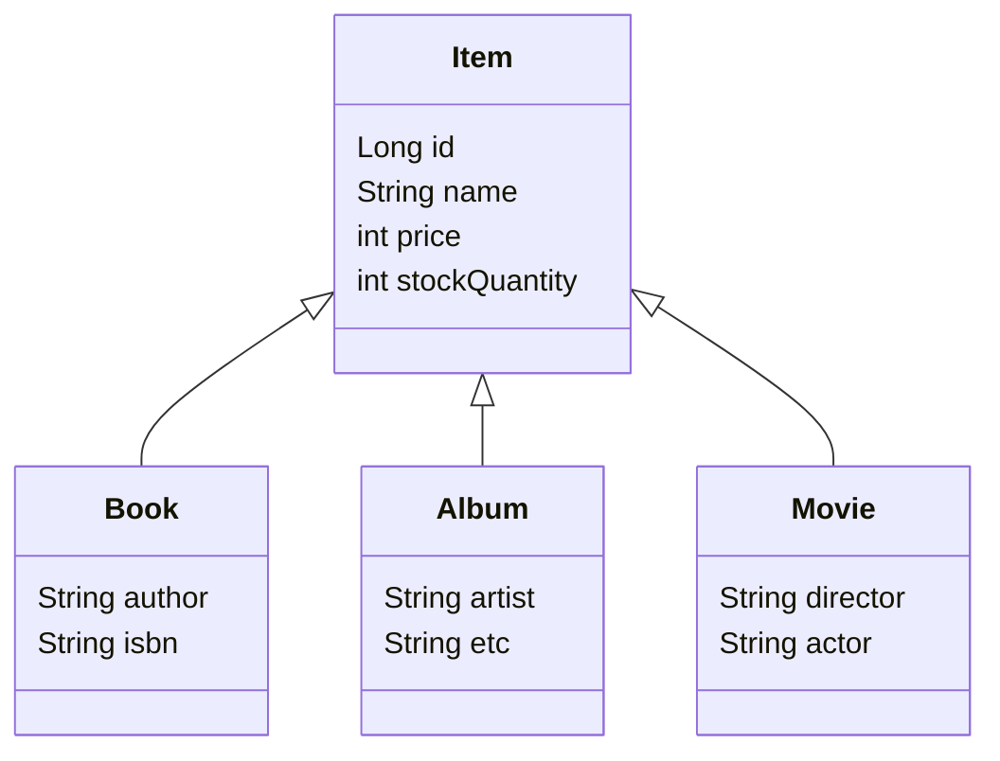

# 05. 상품 도메인 개발 — 상품 계층과 재고 관리

> 현재 `study/SpringBootJPA/jpashop`의 `Item`, `Book`, `Album`, `Movie`, `Category` 코드를 기준으로 정리한다.
> Spring Boot 3.x, JPA `jakarta.persistence` 기준

---

## 1. 상품 계층 구조

상품은 공통 속성을 `Item`에 두고, 상품별 속성은 하위 엔티티에서 관리한다.



현재 `Item`은 공통 상품 정보와 재고 수량을 가지고, `Book`, `Album`, `Movie`가 각 상품의 추가 속성을 가진다.

```java
@Entity
@Inheritance(strategy = InheritanceType.SINGLE_TABLE)
@DiscriminatorColumn(name = "dtype")
public abstract class Item {

    @Id @GeneratedValue
    @Column(name = "item_id")
    private Long id;

    private String name;
    private int price;
    private int stockQuantity;
}
```

`SINGLE_TABLE` 전략은 하위 타입을 `item` 테이블 하나에 저장하고, `dtype`으로 실제 상품 타입을 구분한다. 조회 시 조인이 필요 없어 단순하지만, 도서에만 필요한 `author` 같은 컬럼은 음반·영화 행에서 `null`이 된다.

---

## 2. 상품 타입 구분

각 하위 타입에는 `@Entity`, `@DiscriminatorValue`를 선언한다.

```java
@Entity
@DiscriminatorValue("Book")
public class Book extends Item {
    private String author;
    private String isbn;
}
```

JPA는 `dtype = 'Book'`인 행을 조회할 때 `Book` 객체로 복원한다. 상위 타입인 `Item`으로 조회해도 실제 타입에 맞는 하위 객체를 받을 수 있다.

현재 `Item`은 `@Getter`만 선언하고 setter를 제거했다. 재고처럼 도메인 규칙이 필요한 상태는 의미 있는 메서드로만 변경한다.

---

## 3. 재고 변경은 상품이 책임진다

재고 증감 규칙을 서비스에 흩어 두지 않고 `Item`에 둔다. 현재 구현은 다음과 같다.

```java
public void addStock(int quantity) {
    this.stockQuantity += quantity;
}

public void removeStock(int quantity) {
    int resetStock = this.stockQuantity - quantity;
    if (resetStock < 0) {
        throw new NotEnoughStockException("need more stock");
    }
    this.stockQuantity = resetStock;
}
```

- 주문 취소로 재고를 복구할 때는 `addStock()`을 호출한다.
- 주문으로 재고를 차감할 때는 `removeStock()`을 호출한다.
- 재고가 부족하면 예외를 던져 음수 재고를 막는다.

`NotEnoughStockException`은 `RuntimeException`을 상속한다. 주문 서비스의 트랜잭션 안에서 발생하면 기본 정책에 따라 트랜잭션도 롤백된다.

이렇게 하면 재고 계산 규칙과 상태가 같은 객체에 있어, 주문 기능에서도 상품의 메서드를 호출하는 방식으로 일관되게 처리할 수 있다.

---

## 4. 카테고리 관계

현재 `Category`는 상품과 다대다 관계이며, 자기 참조 관계로 부모·자식 카테고리를 표현한다.

```java
@ManyToMany
@JoinTable(name = "category_item",
        joinColumns = @JoinColumn(name = "category_id"),
        inverseJoinColumns = @JoinColumn(name = "item_id"))
private List<Item> items = new ArrayList<>();

@ManyToOne(fetch = FetchType.LAZY)
@JoinColumn(name = "parent_id")
private Category parent;

@OneToMany(mappedBy = "parent")
private List<Category> child = new ArrayList<>();
```

`addChildCategory()`는 부모 컬렉션과 자식의 `parent`를 함께 맞추는 연관관계 편의 메서드다.

⚠️ `@ManyToMany`는 중간 테이블에 등록일·정렬 순서 같은 컬럼을 추가하기 어렵다. 실무에서는 `CategoryItem` 같은 연결 엔티티를 만들고 `@ManyToOne` 두 개로 풀어내는 방식을 우선 고려한다.

---

## 5. 상품 리포지토리와 서비스

```java
@Repository
@RequiredArgsConstructor
public class ItemRepository {
    private final EntityManager em;

    public void save(Item item) {
        if (item.getId() == null) {
            em.persist(item);
        } else {
            em.merge(item);
        }
    }

    public Item findOne(Long id) {
        return em.find(Item.class, id);
    }

    public List<Item> findAll() {
        return em.createQuery("select i from Item i", Item.class)
                .getResultList();
    }
}
```

새 상품은 ID가 없으므로 `persist()`로 영속화한다. ID가 있는 분리 상태 엔티티를 저장할 때는 `merge()`가 새 영속 객체를 반환한다는 점을 주의한다. 화면 수정 기능은 `merge()`보다 서비스에서 엔티티를 조회한 뒤 필요한 상태만 변경하는 방식이 더 안전하다.

```java
@Service
@Transactional(readOnly = true)
@RequiredArgsConstructor
public class ItemService {
    private final ItemRepository itemRepository;

    @Transactional
    public void saveItem(Item item) {
        itemRepository.save(item);
    }

    public Item findOne(Long itemId) {
        return itemRepository.findOne(itemId);
    }

    public List<Item> findItems() {
        return itemRepository.findAll();
    }
}
```

서비스는 조회를 기본 `readOnly = true`로 두고, 저장 메서드에만 쓰기 트랜잭션을 선언한다.

## 6. 리포지토리·서비스 테스트

`ItemRepositoryTest`와 `ItemServiceTest`는 `Book`을 저장한 뒤 단건 조회와 전체 조회를 검증한다.

```java
@SpringBootTest
@Transactional
class ItemServiceTest {

    @Autowired ItemService itemService;

    @Test
    void 상품_등록과_조회() {
        Book book = new Book();
        book.addStock(5);

        itemService.saveItem(book);

        assertThat(itemService.findOne(book.getId())).isSameAs(book);
    }
}
```

테스트 클래스의 `@Transactional`은 테스트 종료 후 기본적으로 롤백한다. 저장과 조회가 같은 영속성 컨텍스트 안에서 일어나므로 `isSameAs(book)`으로 1차 캐시의 동일성도 확인할 수 있다.

## ✅ 핵심 요약

1. `Item`은 공통 상품 속성과 재고를, 하위 타입은 상품별 속성을 가진다.
2. `SINGLE_TABLE` + `dtype`로 상품 상속을 한 테이블에 매핑한다.
3. 재고 증감·재고 부족 검증은 `Item` 도메인 메서드가 담당한다.
4. 현재 `Category`의 다대다 매핑은 학습용이며, 실무에서는 연결 엔티티로 푼다.
5. 리포지토리와 서비스 테스트는 상품 저장·단건 조회·전체 조회를 검증하고, 종료 시 롤백한다.
