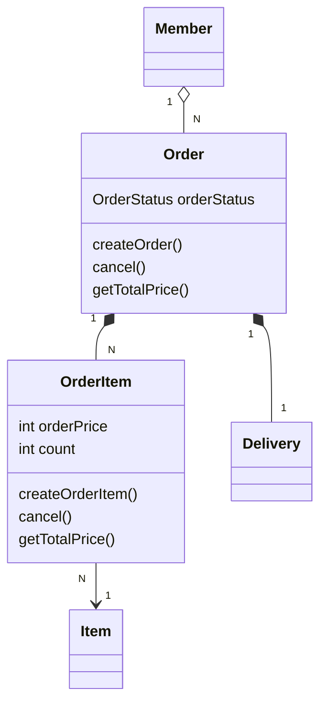

# 06. 주문 도메인 개발 — 주문·주문상품 엔티티와 도메인 모델 패턴

> `6. 주문 도메인 개발.pdf` 강의자료와 현재 `study/SpringBootJPA/jpashop`의 `Order`, `OrderItem`, `Delivery` 코드를 기준으로 정리한다.
> Spring Boot 3.x, JPA `jakarta.persistence` 기준.
>
> ⚠️ 현 시점 실습 코드에는 **엔티티와 연관관계 편의 메서드까지** 작성되어 있고, 생성·비즈니스·조회 메서드와 `OrderRepository`·`OrderService`·`OrderSearch`·`OrderServiceTest`는 아직 없다. 아래에서 **이미 작성된 부분은 내 코드**를, **아직 없는 부분은 PDF 참조 구현**을 인용하며 그 차이를 명시한다.

---

## 0. 이 챕터에서 만드는 것

| 구현 기능 | 설명 |
|-----------|------|
| 상품 주문 | 회원·상품·수량으로 주문을 생성하고 재고를 차감 |
| 주문 내역 조회 | 검색 조건(`OrderSearch`)으로 주문 동적 조회 |
| 주문 취소 | 주문 상태를 `CANCEL`로 바꾸고 재고 복구 |

작업 순서는 **엔티티 → 리포지토리 → 서비스 → 검색 → 테스트** 다. 이 챕터의 핵심은 **비즈니스 로직을 엔티티에 두는 도메인 모델 패턴**이다.



---

## 1. 주문 엔티티 (`Order`)

현재 작성된 코드다. 연관관계와 편의 메서드까지 되어 있다.

```java
@Entity
@Table(name = "orders")   // 예약어 order를 피하려고 테이블명을 orders로
@Getter @Setter
public class Order {

    @Id @GeneratedValue
    @Column(name = "order_id")
    private Long id;

    @ManyToOne(fetch = FetchType.LAZY)
    @JoinColumn(name = "member_id")
    private Member member;

    // 주문을 취소하면 배송이 취소되므로 주문을 주인관계로 설정하였다.
    // Order 시에 Delivery 자동 persist 설정
    @OneToOne(fetch = FetchType.LAZY, cascade = CascadeType.ALL)
    @JoinColumn(name = "delivery_id")
    private Delivery delivery;

    // Order에 저장 > OrderItem에 자동저장(persist 생략)
    @OneToMany(mappedBy = "order", cascade = CascadeType.ALL)
    private List<OrderItem> orderItems = new ArrayList<>();

    private LocalDateTime orderDate;

    @Enumerated(value = EnumType.STRING)
    private OrderStatus orderStatus; // order or cancel
```

핵심 매핑 포인트:

| 매핑 | 이유 |
|------|------|
| `@ManyToOne(LAZY)` member | 주문의 연관관계 주인(FK `member_id` 보유). 모든 연관관계는 지연 로딩이 기본. |
| `@OneToMany(mappedBy="order")` orderItems | 주인은 `OrderItem.order`. `Order`는 읽기 전용 거울. |
| `@OneToOne` delivery + `delivery_id` | 주문↔배송 1:1. **FK를 자주 접근하는 `Order` 쪽에** 둔다. |
| `cascade = ALL` (delivery, orderItems) | `Order`만 `persist`하면 연관된 `Delivery`·`OrderItem`이 함께 저장된다. |
| `@Enumerated(EnumType.STRING)` | `ORDINAL`(숫자)은 순서가 밀리면 값이 깨지므로 **반드시 STRING**. |

> 💡 **`@Enumerated`는 STRING 고정** — 기본값이 `ORDINAL`이라 중간에 enum 상수를 추가하면 기존 데이터의 의미가 어긋난다. 기본편 [04. 엔티티 매핑](../jpaBasic/04.%20엔티티%20매핑.md)에서 다룬 내용과 동일하다.

### 연관관계 편의 메서드

양방향 연관관계는 **양쪽을 한 번에 세팅**하는 메서드로 실수를 막는다. 현재 코드에 이미 작성되어 있다.

```java
// === 연관관계 편의 메서드 ===
public void setMember(Member member) {
    this.member = member;
    member.getOrders().add(this);
}

public void addOrderItem(OrderItem orderItem){
    orderItems.add(orderItem);
    orderItem.setOrder(this);
}

public void setDelivery(Delivery delivery){
    this.delivery = delivery;
    delivery.setOrder(this);
}
```

한쪽만 세팅하면 객체 그래프와 DB 상태가 어긋날 수 있다. 편의 메서드는 **핵심적으로 컨트롤하는 엔티티**(여기서는 `Order`)에 둔다. 연관관계 편의 메서드 개념은 기본편 [05. 연관관계 매핑 기초](../jpaBasic/05.%20연관관계%20매핑%20기초.md) 참고.

### ⚠️ 아직 없는 부분 — 생성·비즈니스·조회 메서드 (PDF 참조)

강의에서는 여기에 **정적 생성 메서드**와 **도메인 로직**을 추가한다. (현재 내 코드엔 없음)

```java
//==생성 메서드==//
public static Order createOrder(Member member, Delivery delivery, OrderItem... orderItems) {
    Order order = new Order();
    order.setMember(member);
    order.setDelivery(delivery);
    for (OrderItem orderItem : orderItems) {
        order.addOrderItem(orderItem);
    }
    order.setStatus(OrderStatus.ORDER);     // ← 내 필드명은 orderStatus (아래 주의 참고)
    order.setOrderDate(LocalDateTime.now());
    return order;
}

//==비즈니스 로직==//
/** 주문 취소 */
public void cancel() {
    if (delivery.getStatus() == DeliveryStatus.COMP) {
        throw new IllegalStateException("이미 배송완료된 상품은 취소가 불가능합니다.");
    }
    this.setStatus(OrderStatus.CANCEL);
    for (OrderItem orderItem : orderItems) {
        orderItem.cancel();   // 각 주문상품이 스스로 재고를 복구
    }
}

//==조회 로직==//
/** 전체 주문 가격 조회 */
public int getTotalPrice() {
    return orderItems.stream()
            .mapToInt(OrderItem::getTotalPrice)
            .sum();
}
```

- **생성 메서드 `createOrder()`** — 주문 생성의 복잡한 조립(회원·배송·주문상품 세팅, 상태·시간 초기화)을 한 곳에 응집한다. 생성 지점을 이 메서드로 **강제**하면 이후 생성 규칙이 바뀌어도 여기만 고치면 된다.
- **주문 취소 `cancel()`** — 상태를 `CANCEL`로 바꾸고, 각 `OrderItem`에게 취소를 위임해 재고를 되돌린다. 배송 완료면 예외로 취소를 막는다.
- **전체 가격 `getTotalPrice()`** — 주문상품들의 가격 합. (실무에선 조회 성능을 위해 주문에 total 필드를 두고 역정규화하기도 한다.)

> ⚠️ **내 코드와의 차이 (필드명)**
> - PDF: 필드명 `status` → `setStatus()/getStatus()`
> - 내 코드: 필드명 `orderStatus` → `setOrderStatus()/getOrderStatus()`
>
> 생성·취소 메서드를 실제로 추가할 때는 `setStatus` → `setOrderStatus`로 맞춰야 한다.

> ⚠️ **내 코드와의 차이 (`DeliveryStatus`)**
> `cancel()`의 `delivery.getStatus()`도 내 `Delivery` 필드명은 `deliveryStatus`라 `delivery.getDeliveryStatus()`가 된다. 취소 불가 상태 상수 `COMP`도 `DeliveryStatus`에 정의되어 있어야 한다.

---

## 2. 주문상품 엔티티 (`OrderItem`)

현재 작성된 코드 — 필드와 연관관계만 있다.

```java
@Entity
@Getter @Setter
public class OrderItem {
    @Id @GeneratedValue
    @Column(name = "order_item_id")
    private Long id;

    private int orderPrice;   // 주문 당시 가격 (상품 가격을 스냅샷)
    private int count;        // 주문 수량

    @ManyToOne(fetch = FetchType.LAZY)
    @JoinColumn(name = "order_id")
    private Order order;

    @ManyToOne(fetch = FetchType.LAZY)
    @JoinColumn(name = "item_id")
    private Item item;
}
```

`orderPrice`를 따로 두는 이유: 상품 가격은 시간이 지나 바뀔 수 있으므로, **주문 시점의 가격을 스냅샷**으로 보관한다.

> 💡 PDF는 `@Table(name = "order_item")`을 명시한다. 내 코드는 미지정이라 기본 규칙상 테이블명 `order_item`(카멜→스네이크)으로 생성된다 — 결과는 동일하다.

### ⚠️ 아직 없는 부분 — 생성·비즈니스·조회 메서드 (PDF 참조)

```java
//==생성 메서드==//
public static OrderItem createOrderItem(Item item, int orderPrice, int count) {
    OrderItem orderItem = new OrderItem();
    orderItem.setItem(item);
    orderItem.setOrderPrice(orderPrice);
    orderItem.setCount(count);

    item.removeStock(count);   // 주문 수량만큼 재고 차감
    return orderItem;
}

//==비즈니스 로직==//
/** 주문 취소 */
public void cancel() {
    getItem().addStock(count); // 취소 수량만큼 재고 복구
}

//==조회 로직==//
/** 주문상품 전체 가격 조회 */
public int getTotalPrice() {
    return getOrderPrice() * getCount();
}
```

- `createOrderItem()` — 생성과 동시에 `item.removeStock(count)`로 재고를 줄인다. 재고 규칙은 [05. 상품 도메인 개발](05.%20상품%20도메인%20개발.md)에서 `Item`이 책임진다.
- `cancel()` — `addStock(count)`로 재고를 되돌린다.
- `getTotalPrice()` — `주문가격 × 수량`.

---

## 3. 주문 리포지토리 (`OrderRepository`) — PDF 참조

> 아직 작성 전. 저장·단건 조회는 단순하고, 동적 검색(`findAll`)은 §5에서 다룬다.

```java
@Repository
@RequiredArgsConstructor
public class OrderRepository {
    private final EntityManager em;

    public void save(Order order) {
        em.persist(order);   // 주문은 항상 신규 → persist만
    }

    public Order findOne(Long id) {
        return em.find(Order.class, id);
    }

    // public List<Order> findAll(OrderSearch orderSearch) { ... }  // §5
}
```

`Item`과 달리 `save`에 `merge` 분기가 없다. 주문은 새로 생성되는 흐름만 있어 `persist`만으로 충분하다.

---

## 4. 주문 서비스 (`OrderService`) — PDF 참조

> 아직 작성 전. **서비스는 얇고, 로직은 엔티티에 있다**는 게 이 챕터의 메시지다.

```java
@Service
@Transactional(readOnly = true)
@RequiredArgsConstructor
public class OrderService {

    private final MemberRepository memberRepository;
    private final OrderRepository orderRepository;
    private final ItemRepository itemRepository;

    /** 주문 */
    @Transactional
    public Long order(Long memberId, Long itemId, int count) {
        // 엔티티 조회
        Member member = memberRepository.findOne(memberId);
        Item item = itemRepository.findOne(itemId);

        // 배송정보 생성
        Delivery delivery = new Delivery();
        delivery.setAddress(member.getAddress());
        delivery.setStatus(DeliveryStatus.READY);   // 내 코드: setDeliveryStatus

        // 주문상품 생성 (재고 차감 포함)
        OrderItem orderItem = OrderItem.createOrderItem(item, item.getPrice(), count);

        // 주문 생성
        Order order = Order.createOrder(member, delivery, orderItem);

        // 주문 저장 (cascade로 delivery, orderItem 함께 저장)
        orderRepository.save(order);
        return order.getId();
    }

    /** 주문 취소 */
    @Transactional
    public void cancelOrder(Long orderId) {
        Order order = orderRepository.findOne(orderId);
        order.cancel();   // 상태 변경 + 재고 복구를 엔티티가 처리
    }
}
```

### 💡 이 챕터의 핵심 — 도메인 모델 패턴

`order()`, `cancelOrder()`를 보면 **서비스는 조회하고 위임할 뿐**, 실제 로직(재고 차감/복구, 상태 전환)은 전부 엔티티에 있다.

| 패턴 | 설명 |
|------|------|
| **도메인 모델 패턴** | 엔티티가 비즈니스 로직을 갖고 객체지향을 적극 활용 (이 프로젝트) |
| **트랜잭션 스크립트 패턴** | 엔티티는 데이터만, 로직은 전부 서비스에 |

> 💡 **`cascade`로 저장이 되는 이유** — `orderRepository.save(order)` 한 번으로 `delivery`, `orderItem`이 함께 `persist`된다. `Order`에 `cascade = ALL`을 걸었기 때문. cascade는 **소유자가 명확하고 생명주기를 함께하는** 연관관계에만 쓴다(여기선 `Order`만 `Delivery`·`OrderItem`을 참조).

> ⚠️ **트랜잭션 롤백과 더티 체킹** — 재고 차감은 엔티티 필드 변경일 뿐인데도 DB에 반영된다. `@Transactional` 안에서 영속 상태 엔티티의 변경은 커밋 시 **변경 감지(dirty checking)** 로 자동 UPDATE 되기 때문. 예외가 나면 트랜잭션이 롤백되어 재고 차감도 함께 되돌아간다.

> ⚠️ **내 코드 반영 시 주의** — `setStatus`→`setOrderStatus`, `delivery.setStatus`→`setDeliveryStatus`. 그리고 예제는 단순화를 위해 **한 번에 상품 하나만** 주문한다.

Spring 기초(`@Transactional`, 생성자 주입, `readOnly`)는 [spring-study/issues](https://github.com/titianfall/spring-study/tree/main/issues) 참고.

---

## 5. 주문 검색 기능 (`OrderSearch`) — PDF 참조

> 아직 작성 전. **동적 쿼리**를 어떻게 만들지가 주제다.

검색 조건 객체:

```java
public class OrderSearch {
    private String memberName;       // 회원 이름 (부분 검색)
    private OrderStatus orderStatus; // 주문 상태 [ORDER, CANCEL]
    // Getter, Setter
}
```

조건 유무에 따라 `where`/`and`를 조립해야 하는데, 세 가지 방식이 있다.

### ① JPQL 문자열 조립 — 동작하지만 번거로움

```java
public List<Order> findAll(OrderSearch orderSearch) {
    String jpql = "select o From Order o join o.member m";
    boolean isFirstCondition = true;

    if (orderSearch.getOrderStatus() != null) {
        jpql += isFirstCondition ? " where" : " and";
        isFirstCondition = false;
        jpql += " o.status = :status";
    }
    if (StringUtils.hasText(orderSearch.getMemberName())) {
        jpql += isFirstCondition ? " where" : " and";
        isFirstCondition = false;
        jpql += " m.name like :name";
    }

    TypedQuery<Order> query = em.createQuery(jpql, Order.class).setMaxResults(1000);
    if (orderSearch.getOrderStatus() != null) {
        query.setParameter("status", orderSearch.getOrderStatus());
    }
    if (StringUtils.hasText(orderSearch.getMemberName())) {
        query.setParameter("name", orderSearch.getMemberName());
    }
    return query.getResultList();
}
```

문자열을 이어 붙이므로 **오타·띄어쓰기 버그**가 나기 쉽다.

### ② JPA Criteria — 표준이지만 너무 복잡

```java
public List<Order> findAllByCriteria(OrderSearch orderSearch) {
    CriteriaBuilder cb = em.getCriteriaBuilder();
    CriteriaQuery<Order> cq = cb.createQuery(Order.class);
    Root<Order> o = cq.from(Order.class);
    Join<Order, Member> m = o.join("member", JoinType.INNER);

    List<Predicate> criteria = new ArrayList<>();
    if (orderSearch.getOrderStatus() != null) {
        criteria.add(cb.equal(o.get("status"), orderSearch.getOrderStatus()));
    }
    if (StringUtils.hasText(orderSearch.getMemberName())) {
        criteria.add(cb.like(m.<String>get("name"), "%" + orderSearch.getMemberName() + "%"));
    }
    cq.where(cb.and(criteria.toArray(new Predicate[0])));
    return em.createQuery(cq).setMaxResults(1000).getResultList();
}
```

컴파일 타임 안전성은 있지만 **가독성이 나쁘고 유지보수가 어렵다**. 실무에서 거의 안 쓴다.

### ✅ 결론 — Querydsl

> JPA Criteria는 표준이지만 실무에 부적합하다. 동적 쿼리의 실질적 정답은 **Querydsl**이며, 뒤 챕터에서 다룬다. 지금은 JPQL 방식으로 넘어간다.

> ⚠️ `o.status` 는 PDF 기준. 내 필드명 `orderStatus`를 쓰면 JPQL도 `o.orderStatus = :status`가 된다.

---

## 6. 주문 기능 테스트 (`OrderServiceTest`) — PDF 참조

> 아직 작성 전. 검증 항목: **① 주문 성공 ② 재고 초과 시 예외 ③ 주문 취소 시 재고 복구**.

### 주문 성공

```java
@SpringBootTest
@Transactional
public class OrderServiceTest {

    @PersistenceContext EntityManager em;
    @Autowired OrderService orderService;
    @Autowired OrderRepository orderRepository;

    @Test
    public void 상품주문() throws Exception {
        // given
        Member member = createMember();
        Item item = createBook("시골 JPA", 10000, 10); // 이름, 가격, 재고
        int orderCount = 2;

        // when
        Long orderId = orderService.order(member.getId(), item.getId(), orderCount);

        // then
        Order getOrder = orderRepository.findOne(orderId);
        assertEquals(OrderStatus.ORDER, getOrder.getOrderStatus(), "상품 주문시 상태는 ORDER");
        assertEquals(1, getOrder.getOrderItems().size(), "주문한 상품 종류 수");
        assertEquals(10000 * 2, getOrder.getTotalPrice(), "주문 가격 = 가격 * 수량");
        assertEquals(8, item.getStockQuantity(), "주문 수량만큼 재고 감소");
    }
}
```

### 재고 수량 초과 → 예외

```java
@Test
public void 상품주문_재고수량초과() {
    // given
    Member member = createMember();
    Item item = createBook("시골 JPA", 10000, 10);
    int orderCount = 11; // 재고보다 많음

    // when, then
    assertThrows(NotEnoughStockException.class,
            () -> orderService.order(member.getId(), item.getId(), orderCount));
}
```

`Item.removeStock()`에서 재고가 음수가 되면 `NotEnoughStockException`이 발생한다([05. 상품 도메인 개발](05.%20상품%20도메인%20개발.md) 참고).

### 주문 취소 → 재고 복구

```java
@Test
public void 주문취소() {
    // given
    Member member = createMember();
    Item item = createBook("시골 JPA", 10000, 10);
    Long orderId = orderService.order(member.getId(), item.getId(), 2);

    // when
    orderService.cancelOrder(orderId);

    // then
    Order getOrder = orderRepository.findOne(orderId);
    assertEquals(OrderStatus.CANCEL, getOrder.getOrderStatus(), "취소 상태는 CANCEL");
    assertEquals(10, item.getStockQuantity(), "취소한 만큼 재고 복구");
}
```

### ⚠️ 강의(구버전)와의 차이 — JUnit4 → JUnit5

| 항목 | JUnit4 (강의 영상) | JUnit5 (현재 프로젝트) |
|------|--------------------|------------------------|
| `assertEquals` 인자 순서 | `(메시지, 기대값, 실제값)` | `(기대값, 실제값, 메시지)` |
| 예외 검증 | `@Test(expected = X.class)` | `assertThrows(X.class, () -> ...)` |

```java
// 영상(JUnit4):  assertEquals("상품 주문시 상태는 ORDER", OrderStatus.ORDER, getOrder.getStatus());
// 현재(JUnit5):  assertEquals(OrderStatus.ORDER, getOrder.getStatus(), "상품 주문시 상태는 ORDER");
```

> 💡 테스트 클래스의 `@Transactional`은 각 테스트 종료 후 **롤백**한다. 주문·조회가 같은 영속성 컨텍스트에서 일어나 1차 캐시로 동일 인스턴스를 본다.

---

## ✅ 핵심 요약

1. **주문은 도메인의 중심** — `Order`가 `Member(N:1)`, `OrderItem(1:N)`, `Delivery(1:1)`를 연결하고, `cascade = ALL`로 `save(order)` 한 번에 함께 저장된다.
2. **비즈니스 로직은 엔티티에** — `createOrder`/`cancel`/`getTotalPrice`(주문), `createOrderItem`/`cancel`/`getTotalPrice`(주문상품). 서비스는 조회·위임만 하는 **도메인 모델 패턴**.
3. **재고는 `Item`이 책임** — 주문 시 `removeStock`, 취소 시 `addStock`. 초과 시 `NotEnoughStockException`.
4. **주문 상태는 `@Enumerated(STRING)`** — `ORDINAL` 금지. (내 필드명은 `orderStatus`, PDF는 `status`)
5. **동적 검색** — JPQL 문자열/JPA Criteria 모두 실무 부적합. 정답은 뒤에 나올 **Querydsl**.
6. 테스트는 **주문 성공·재고 초과 예외·취소 후 재고 복구** 세 가지를 검증한다. JUnit5 기준으로 `assertEquals` 순서·`assertThrows`를 사용한다.

> 📌 **다음 작업 메모** — 현재 실습 코드는 엔티티 뼈대까지다. 실제로는 §1·§2의 생성·비즈니스·조회 메서드와 §3~§6의 리포지토리·서비스·검색·테스트를 추가하면서 위 필드명 차이(`orderStatus`, `deliveryStatus`)를 반영해야 한다.
