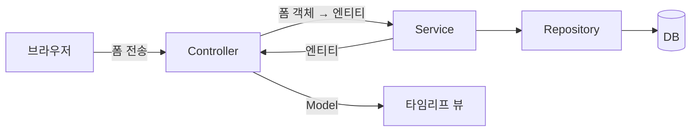
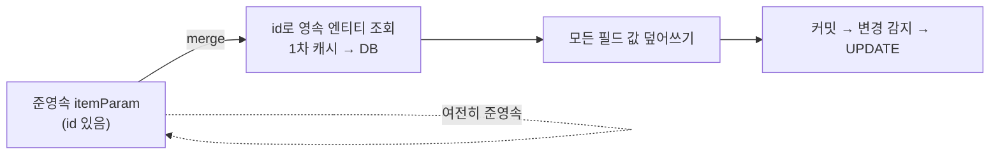

# 07. 웹 계층 개발 — 컨트롤러·타임리프와 준영속 엔티티 수정

> `7. 웹 계층 개발.pdf` 강의자료와 현재 `study/SpringBootJPA/jpashop`의 `HomeController`, `MemberController`, `MemberForm`, `ItemController`, `BookForm`, `OrderController`, 그리고 `templates/` 아래 뷰 코드를 기준으로 정리한다.
> Spring Boot 3.x, JPA `jakarta.persistence`, 타임리프 기준.
>
> ✅ 홈·회원 등록/목록·상품 등록/목록/수정·주문·주문 목록/취소까지 **이 챕터의 구현이 모두 끝난 상태**다. 아래는 실제 내 코드를 인용하며, 강의(PDF/영상, 구버전)와 차이가 있는 곳은 `⚠️`로 명시한다.

---

## 0. 이 챕터에서 만드는 것

| 화면 | URL | 컨트롤러 |
|------|-----|----------|
| 홈 | `GET /` | `HomeController` |
| 회원 등록 | `GET/POST /members/new` | `MemberController` |
| 회원 목록 | `GET /members` | `MemberController` |
| 상품 등록 | `GET/POST /items/new` | `ItemController` |
| 상품 목록 | `GET /items` | `ItemController` |
| 상품 수정 | `GET/POST /items/{itemId}/edit` | `ItemController` |
| 상품 주문 | `GET/POST /order` | `OrderController` |
| 주문 목록/검색 | `GET /orders` | `OrderController` |
| 주문 취소 | `POST /orders/{orderId}/cancel` | `OrderController` |

이 챕터의 진짜 핵심은 화면이 아니라 **§6 준영속 엔티티 수정(변경 감지 vs 병합)** 이다. 나머지는 앞서 만든 서비스를 화면에 연결하는 작업이다.



---

## 1. 홈 컨트롤러와 타임리프

```java
// 내 코드 (HomeController)
@Controller
@Slf4j
public class HomeController {
    // Logger log = LoggerFactory.getLogger(getClass());
    @RequestMapping("/")
    public String home() {
        log.info("home controller");
        return "home"; // > /templates/{"home"}.html
    }
}
```

⚠️ **패키지 차이** — 강의는 `jpabook.jpashop.web`, 내 프로젝트는 `jpabook.jpashop.controller`다. 이 문서는 내 패키지(`controller`) 기준으로 쓴다.

💡 `@Slf4j`는 롬복이 `private static final Logger log = ...`를 만들어 준다. 주석으로 남겨 둔 `LoggerFactory.getLogger(getClass())`가 롬복이 대신 써 주는 그 코드다. 스프링 기본 개념은 [spring-study/issues](https://github.com/titianfall/spring-study/tree/main/issues) 참고.

### 타임리프 뷰 이름 해석

컨트롤러가 반환한 문자열은 `prefix + viewName + suffix`로 해석된다.

```yaml
spring:
  thymeleaf:
    prefix: classpath:/templates/
    suffix: .html
```

| 반환값 | 실제 파일 |
|--------|-----------|
| `"home"` | `resources/templates/home.html` |
| `"members/memberList"` | `resources/templates/members/memberList.html` |

💡 **스프링 부트는 이 값이 기본값**이라 `application.yml`에 따로 안 써도 된다. 내 `application.yml`에도 thymeleaf 설정이 없는데 정상이다.

⚠️ **뷰 이름 앞에 `/`를 붙이지 않는다** — `return "/members/memberList"`처럼 쓰면 `templates//members/memberList.html`로 슬래시가 겹친다. 동작은 하지만 관례에 어긋나므로 `"members/memberList"`로 통일한다. (`redirect:/`는 뷰 이름이 아니라 URL이므로 슬래시가 맞다.)

### 뷰 리소스 구성

부트스트랩을 `resources/static`에, 공통 조각을 `templates/fragments/`에 둔다.

```
resources/
├── static/
│   ├── css/bootstrap.min.css
│   ├── css/jumbotron-narrow.css
│   └── js/
└── templates/
    ├── home.html
    ├── fragments/{header, bodyHeader, footer}.html
    ├── members/{createMemberForm, memberList}.html
    ├── items/{createItemForm, itemList, updateItemForm}.html
    └── order/{orderForm, orderList}.html
```

프래그먼트는 `th:fragment`로 선언하고 `th:replace`로 끼워 넣는다.

```html
<!-- 선언: fragments/header.html -->
<head th:fragment="header"> ... </head>

<!-- 사용: home.html -->
<head th:replace="~{fragments/header :: header}">
```

⚠️ **`~{...}` 문법** — 강의 영상은 `th:replace="fragments/header :: header"`처럼 쓰지만, 최신 타임리프(부트 3.x)에서는 **프래그먼트 표현식을 `~{...}`로 감싸야 한다**. 내 뷰는 전부 `~{fragments/header :: header}` 형태로 작성했다.

⚠️ **PDF 복붙 주의** — PDF에서 HTML을 복사하면 `form-control`이 `formcontrol`로 붙거나, 태그 순서가 뒤엉키는 경우가 있다. 실제로 내 `orderForm.html`도 복붙 과정에서 `<option value="">회원선택</option>` 한 줄이 `<option class="form-group">` + `<div value="">회원선택</option>`으로 조각나 `</select>`·`</div>`가 먼저 닫히는 사고가 났었다. 복붙 후에는 **태그 짝이 맞는지** 반드시 확인한다.

> 💡 **HTML 수정이 즉시 반영되게 하려면**: `spring-boot-devtools` 의존성을 추가하고, html 수정 후 `build → Recompile`.

---

## 2. 회원 등록 — 폼 객체를 따로 두는 이유

### 폼 객체

```java
// 내 코드 (MemberForm)
@Getter @Setter
public class MemberForm {
    @NotEmpty(message = "회원 이름은 필수 입니다.") // java spring > validation
    private String name;

    // private Address address;
    private String city;
    private String street;
    private String zipcode;
}
```

주석으로 남겨 둔 `private Address address;`가 의미심장하다. 폼은 **화면의 입력 칸 모양 그대로**(`city`, `street`, `zipcode` 3개) 받고, `Address` 값 타입 조립은 컨트롤러가 한다. 화면과 엔티티의 구조가 다를 수 있다는 걸 보여주는 지점이다.

⚠️ **`jakarta.validation`** — 강의(부트 2.x)는 `javax.validation.constraints.NotEmpty`. 부트 3.x부터 `jakarta.validation.constraints.NotEmpty`다. `jakarta.persistence`와 동일한 전환이다.

⚠️ **validation 의존성 필요** — `spring-boot-starter-validation`. 내 `build.gradle`에는 이미 들어 있다.

### 컨트롤러

```java
// 내 코드 (MemberController)
@Controller
@RequiredArgsConstructor
public class MemberController {

    private final MemberService memberService;

    @GetMapping("/members/new") // 화면을 열어보고
    public String createForm(Model model) {
        model.addAttribute("memberForm", new MemberForm());
        return "members/createMemberForm";
    }

    @PostMapping("/members/new") // 실제로 데이터를 등록한다.
    public String create(@Valid MemberForm form, BindingResult result) {
        // springframework.validation.BindingResult > 에러를 다시 members/create
        if(result.hasErrors()) {
            return "members/createMemberForm";
        }
        // jakarta.validation을 통해 @NotEmpty valid검사가 가능하다.
        Address address = new Address(form.getCity(), form.getStreet(), form.getZipcode());

        Member member = new Member();
        member.setName(form.getName());
        member.setAddress(address);

        memberService.join(member);
        return "redirect:/"; // "/" > templates/home.html로 redirect
    }
}
```

`createForm()`에서 **빈 폼 객체를 모델에 넣는 게 필수**다. 이게 없으면 뷰의 `th:object="${memberForm}"`이 참조할 대상이 없어 에러가 난다.

💡 **`Address`는 생성자로만 만든다** — 내 `Address`는 값 타입이라 `@Getter`만 있고 setter가 없다. `protected Address()`(JPA 리플렉션용)와 `Address(city, street, zipcode)` 생성자만 열려 있어서, **한 번 만들면 못 바꾸는 불변 객체**다. 값 타입 개념은 기본편 [09. 값 타입](../jpaBasic/09.%20값%20타입.md) 참고.

| 요소 | 역할 |
|------|------|
| `@Valid` | `MemberForm`의 Bean Validation 실행 |
| `BindingResult` | 바인딩/검증 오류를 담는다. **`@Valid` 파라미터 바로 뒤**에 와야 한다 |
| `result.hasErrors()` | 오류 시 예외 대신 폼 화면으로 되돌린다 |
| `redirect:/` | 등록 성공 후 리다이렉트 (POST 재전송 방지) |

### 검증 오류를 화면에 표시

```html
<!-- 내 코드 (createMemberForm.html) -->
<form role="form" action="/members/new" th:object="${memberForm}" method="post">
    <div class="form-group">
        <label th:for="name">이름</label>
        <input type="text" th:field="*{name}" class="form-control"
                placeholder="이름을 입력하세요"
                th:class="${#fields.hasErrors('name')}? 'form-control fieldError' : 'form-control'">
        <p th:if="${#fields.hasErrors('name')}"
           th:errors="*{name}">Incorrect date</p>
    </div>
    ...
</form>
```

```css
.fieldError {
    border-color: #bd2130;
}
```

| 문법 | 의미 |
|------|------|
| `th:object="${memberForm}"` | 이 폼이 다룰 객체 지정 |
| `th:field="*{name}"` | `id`, `name`, `value`를 한 번에 생성 (`*{}`는 `th:object` 기준 선택 변수식) |
| `#fields.hasErrors('name')` | 해당 필드 오류 여부 |
| `th:errors="*{name}"` | `@NotEmpty(message=...)` 메시지 출력 |

💡 `th:class`가 `class` 속성을 **덮어쓴다**. 그래서 오류 시 `form-control fieldError`(빨간 테두리), 정상 시 `form-control`이 된다.

> 💡 `BindingResult` 덕분에 오류가 나도 **입력값이 유지된 채** 폼이 다시 뜬다. 이게 폼 객체를 쓰는 첫 번째 이유다.

### 🔑 왜 엔티티를 폼에 직접 쓰지 않는가

`Member`를 그대로 폼 객체로 써도 화면은 동작한다. 하지만:

- 화면 요구사항(`@NotEmpty`, 화면 전용 필드)이 **엔티티에 스며든다** → 엔티티가 화면에 의존
- 화면이 바뀔 때마다 엔티티가 바뀌고, 엔티티가 바뀌면 **DB 테이블·다른 화면이 전부 흔들린다**
- 엔티티는 최대한 **순수하게 핵심 비즈니스 로직만** 가져야 한다

내 `Member` 엔티티에 이 이유를 주석으로 정리해 뒀다.

```java
// 내 코드 (Member)
// entity를 외부 api로 노출하면 안되는 2가지이유
// if) 필요에 의해 엔티티에 password를 추가하였다.
// 이때문에 1. 패스워드 노출, 2. api 스펙 변경 두가지 오류가 발생한다.
// private String password;
private String name;
```

> ⚠️ **원칙**: 실무에서 엔티티는 **핵심 비즈니스 로직만 가지고 화면을 위한 로직은 없어야 한다**. 화면·API에는 **폼 객체나 DTO**를 쓴다. 특히 **API는 절대 엔티티를 반환하면 안 된다** (엔티티 변경이 곧 API 스펙 변경 = 장애).
>
> 다만 **화면 로직이 없는 단순 조회**(회원 목록 등)에는 엔티티를 그대로 모델에 담아도 실용적으로 무방하다.

---

## 3. 회원 목록 조회

```java
// 내 코드 (MemberController)
@GetMapping("/members")
public String list(Model model) {
    // 간단한 예제이기 때문에 Entity를 그대로 뿌리기보다는 DTO로 변환해서 뿌려야한다.
    List<Member> members = memberService.findMembers();
    model.addAttribute("members", members);
    return "members/memberList";
}
```

```html
<tr th:each="member : ${members}">
    <td th:text="${member.id}"></td>
    <td th:text="${member.name}"></td>
    <td th:text="${member.address?.city}"></td>
    <td th:text="${member.address?.street}"></td>
    <td th:text="${member.address?.zipcode}"></td>
</tr>
```

💡 **`?.` (Safe Navigation)** — `address`가 `null`이면 NPE 대신 `null`을 반환해 빈 칸으로 출력한다. `Address`는 `@Embedded` 값 타입이라 세 칼럼이 모두 `null`이면 `address` 자체가 `null`로 조회될 수 있다.

💡 `Model`은 컨트롤러 → 뷰로 데이터를 넘기는 스프링 MVC의 통로다.

---

## 4. 상품 등록 / 목록

### 폼 객체

```java
// 내 코드 (BookForm)
@Getter @Setter
public class BookForm {
    private Long id;              // 수정 시 사용. 등록 시에는 null

    private String name;
    private int price;
    private int stockQuantity;

    private String author;        // Book 전용
    private String isbn;          // Book 전용
}
```

⚠️ **`Item`은 상속 구조**(`Item` ← `Book`/`Album`/`Movie`, 단일 테이블 전략)다. 강의는 단순화를 위해 **`Book`만 등록**한다.

### 컨트롤러

```java
// 내 코드 (ItemController)
@Controller
@RequiredArgsConstructor
public class ItemController {

    private final ItemService itemService;

    @GetMapping("/items/new")
    public String createForm(Model model) {
        model.addAttribute("form", new BookForm());
        return "items/createItemForm";
    }

    @PostMapping("/items/new")
    public String create(BookForm form) {

        // setter는 설정하지 말고 createBook() 처럼 setter를 닫고 해야함
        Book book = new Book();
        book.setName(form.getName());
        book.setPrice(form.getPrice());
        book.setStockQuantity(form.getStockQuantity());
        book.setAuthor(form.getAuthor());
        book.setIsbn(form.getIsbn());

        itemService.saveItem(book);

        return "redirect:/items";
    }

    @GetMapping("/items")
    public String list(Model model) {
        List<Item> items = itemService.findItems();
        model.addAttribute("items", items);
        return "items/itemList";
    }
}
```

`ItemService`는 이미 5장에서 만들어 뒀고 그대로 쓴다.

```java
// 내 코드 (ItemService)
@Transactional          // readOnly = false
public void saveItem(Item item) {
    itemRepository.save(item);
}

public List<Item> findItems() {
    return itemRepository.findAll();
}
```

> ⚠️ 내 코드 주석에 직접 써 둔 대로 — **`Book`을 setter로 채우는 건 좋은 설계가 아니다.** `createBook(...)` 같은 정적 생성 메서드가 낫다(6장에서 `Order.createOrder`로 배운 방식). 강의는 진도상 setter로 간다.

### 등록 시 나가는 SQL

`ddl-auto: create` + 단일 테이블 전략이라 `Book`을 저장해도 테이블은 `item` 하나다.

```sql
insert into item (name, price, stock_quantity, author, isbn, dtype, item_id)
values (?, ?, ?, ?, ?, 'Book', ?)
```

💡 **`dtype`** — `@DiscriminatorColumn`. 단일 테이블에 `Book`/`Album`/`Movie`가 섞여 들어가므로, 어떤 타입인지 이 칼럼으로 구분한다. 조회 시 하이버네이트가 `dtype`을 보고 알맞은 자바 타입으로 만들어 준다. 상속 매핑은 기본편 [07. 고급 매핑](../jpaBasic/07.%20고급%20매핑.md) 참고.

### 목록 뷰

```html
<!-- 내 코드 (itemList.html) -->
<tr th:each="item : ${items}">
    <td th:text="${item.id}"></td>
    <td th:text="${item.name}"></td>
    <td th:text="${item.price}"></td>
    <td th:text="${item.stockQuantity}"></td>
    <td th:text="${item instanceof T(jpabook.jpashop.domain.item.Book) ? item.isbn : ''}"></td>
    <td>
        <a href="#" th:href="@{/items/{id}/edit (id=${item.id})}"
           class="btn btn-primary" role="button">수정</a>
    </td>
</tr>
```

`@{...}`는 URL 표현식이고, 괄호 안에서 경로 변수를 치환한다.

> ⚠️ **isbn 칼럼에 `instanceof` 검사를 두른 이유** — `findItems()`는 `List<Item>`을 반환하는데 `isbn`은 `Item`이 아니라 `Book`에만 있는 필드다. 타임리프는 컴파일 타임 타입이 아니라 **런타임 객체에 리플렉션**으로 접근하므로 목록에 `Book`만 있으면 `${item.isbn}`도 잘 동작한다. 하지만 `Album`이나 `Movie`가 하나라도 섞이는 순간 그 행에서 프로퍼티를 못 찾아 **목록 전체가 500**이 된다. 강의 원본 `itemList.html`에 isbn 칼럼이 아예 없는 이유 중 하나다.

> ⚠️ **`<a>`는 반드시 `<td>` 안에** — `<tr>`의 직계 자식으로 `<a>`를 두면 HTML 파서가 **foster parenting**으로 그 요소를 테이블 **바깥**으로 끄집어낸다. 수정 버튼이 표 안이 아니라 표 위에 떠 있게 되는데, 원인을 모르면 CSS를 붙들고 헤매게 된다. `<tr>`의 자식은 `<td>`/`<th>`만 올 수 있다.

---

## 5. 상품 수정 — 폼 채워서 보여주기

```java
// 내 코드 (ItemController)
/**
 * 상품 수정폼
 */
@GetMapping("/items/{itemId}/edit")
public String updateItemForm(@PathVariable("itemId") Long itemId, Model model) {
    Book item = (Book) itemService.findOne(itemId);

    BookForm form = new BookForm();
    form.setId(item.getId());              // hidden 으로 유지
    form.setName(item.getName());
    form.setPrice(item.getPrice());
    form.setStockQuantity(item.getStockQuantity());
    form.setAuthor(item.getAuthor());
    form.setIsbn(item.getIsbn());

    model.addAttribute("form", form);
    return "items/updateItemForm";
}
```

수정 폼은 `id`를 **hidden**으로 들고 다닌다.

```html
<!-- 내 코드 (updateItemForm.html) -->
<form th:object="${form}" method="post">
    <!-- id -->
    <input type="hidden" th:field="*{id}" />
    ...
</form>
```

💡 **`action`이 없는 이유** — 비워 두면 현재 URL(`/items/{itemId}/edit`)로 POST된다. `GET`과 `POST`의 URL이 같으므로 그대로 두면 된다.

동작 흐름:

1. 목록에서 [수정] 클릭 → `GET /items/{itemId}/edit`
2. `updateItemForm()`이 `itemService.findOne(itemId)`로 **영속 엔티티** 조회
3. `BookForm`으로 옮겨 모델에 담고 뷰로 전달
4. 폼 수정 후 Submit → `POST /items/{itemId}/edit`

> ⚠️ **여기서 문제가 시작된다.** 4번에서 폼으로 넘어온 `BookForm` → `new Book()`으로 만든 객체는 **`id`는 있지만 영속성 컨텍스트가 관리하지 않는 객체**다. 이것이 **준영속(detached) 엔티티**다. 변경 감지가 동작하지 않는다.

---

## 6. 🔑 준영속 엔티티와 병합(merge) — 이 챕터의 핵심

### 준영속 엔티티란?

**영속성 컨텍스트가 더는 관리하지 않는 엔티티.** 단, **식별자(`id`)는 가지고 있어서 DB에 한 번 저장됐던 객체**임을 알 수 있다.

```java
Book book = new Book();
book.setId(form.getId());   // ← id가 있다 = 이미 DB에 존재하는 데이터
book.setName(form.getName());
// new 로 만들었으니 영속성 컨텍스트는 이 객체를 모른다 → 준영속
```

준영속 엔티티를 수정하는 방법은 **2가지**다.

### 방법 1 — 변경 감지 (Dirty Checking) ✅ 권장

```java
@Transactional
void update(Item itemParam) {                                  // itemParam: 준영속 엔티티
    Item findItem = em.find(Item.class, itemParam.getId());    // 같은 id로 다시 조회 → 영속 상태
    findItem.setPrice(itemParam.getPrice());                   // 원하는 값만 변경
}                                                              // 커밋 시점에 변경 감지 → UPDATE SQL
```

트랜잭션 안에서 **영속 엔티티를 다시 조회한 뒤, 원하는 속성만 바꾼다.** 커밋 시점에 변경 감지가 동작해 UPDATE가 나간다.

### 방법 2 — 병합 (merge)

```java
@Transactional
void update(Item itemParam) {
    Item mergeItem = em.merge(itemParam);   // 반환값이 영속 엔티티. itemParam은 여전히 준영속
}
```

**merge 동작 순서:**

1. `merge()` 실행
2. 파라미터 엔티티의 **식별자로 1차 캐시 조회** (없으면 DB 조회 후 1차 캐시에 등록)
3. 조회한 영속 엔티티에 **파라미터 엔티티의 값을 전부 밀어 넣는다**
4. 커밋 시점에 변경 감지가 동작 → UPDATE SQL



> ⚠️ **merge의 치명적 함정 — 모든 필드를 교체한다.**
> 변경 감지는 원하는 속성만 바꿀 수 있지만, **merge는 넘긴 엔티티의 모든 필드를 덮어쓴다.**
> 폼에 없어서 값이 채워지지 않은 필드는 **`null`로 업데이트**된다.
>
> merge를 쓰려면 **모든 필드를 항상 폼에서 유지**해야 하는데, 이건 유지보수 지옥이다. **merge는 쓰지 말자.**

### `ItemRepository.save()`의 정체 — 내 코드

```java
// 내 코드 (ItemRepository)
// 상품 저장
public void save(Item item) {
    if(item.getId() == null) {
        em.persist(item);
    } else {
        // 병합시 Item merge 객체를 반환하며 추가적인 수정이 필요할 경우 기존의 객체 대신 새로운 객체를 사용하여야함
        // 단, 병합은 모든 속성이 변경된다는 점이 원하는 속성만 변경하는 dirty checking과의 가장 큰 차이다.
        // 개중에는 속성값이 없을 경우 null로 업데이트 할 위험도 존재한다.
        em.merge(item);
    }
}
```

이제 5장의 이 코드가 왜 그렇게 생겼는지, 그리고 주석에 적어 둔 경고가 무슨 뜻인지 이해된다.

| `item.getId()` | 의미 | 동작 |
|---------------|------|------|
| `null` | 완전 새 객체 | `persist()` — 등록 |
| 값 있음 | 이미 DB에 있던 데이터 (준영속) | `merge()` — 수정 |

> 💡 **`save()`가 등록과 수정을 겸하는 게 어색한 이유** — 이름은 "저장"인데 실제로는 저장 + 수정(병합)을 모두 한다. 클라이언트는 신규인지 수정인지 구분하지 않아도 되는 **이점**이 있지만, `merge` 함정을 그대로 떠안는다.
>
> **결론: 수정(병합)은 준영속 엔티티를 수정할 때만 필요하다.** 영속 상태 엔티티는 변경 감지가 알아서 처리하므로, 애초에 저장소의 수정 메서드를 호출할 필요가 없고 그런 메서드도 없어야 한다.

> 💡 **`save()`가 동작하는 전제** — `Item` 엔티티의 식별자가 `@GeneratedValue`로 자동 생성되어야 한다. 그래야 신규 객체의 `id`가 `null`이다. **식별자를 직접 할당(`@Id`만)** 한다면 `save()` 호출 시 `id`가 이미 있어서 `persist` 대신 `merge`로 빠진다. 이 경우 `id`를 직접 할당하지 말고 `save()`에서 `persist()`를 쓰도록 바꿔야 한다.

---

## 7. 가장 좋은 해결 방법 ✅

> ⚠️ **엔티티를 변경할 때는 항상 변경 감지를 사용하라.**

1. 컨트롤러에서 **어설프게 엔티티를 생성하지 않는다** (`new Book()` 금지)
2. 트랜잭션이 있는 **서비스 계층에** 식별자(`id`)와 변경할 데이터만 명확히 전달 (파라미터 or DTO)
3. 서비스가 **영속 상태의 엔티티를 조회**하고, 엔티티의 데이터를 직접 변경
4. 커밋 시점에 **변경 감지**가 실행된다

### 컨트롤러 — 엔티티를 만들지 않는다

```java
// 내 코드 (ItemController)
/**
 * 상품 수정
 */
@PostMapping("/items/{itemId}/edit")
public String updateItem(@PathVariable Long itemId, @ModelAttribute("form") BookForm form) {
//        Book book = new Book();
//        book.setId(form.getId());
//        book.setName(form.getName());
//        ...
//        > 준영속 엔티티를 만들어 merge 하는 방식. 대신 식별자와 변경할 데이터만 넘긴다.

    itemService.updateItem(itemId, new UpdateBookDto(
            form.getName(), form.getPrice(), form.getStockQuantity(),
            form.getAuthor(), form.getIsbn()));
    return "redirect:/items";
}
```

주석 처리한 `new Book()` 블록이 바로 **준영속 엔티티를 만드는 잘못된 방식**이다. 지우지 않고 남겨 두면 §6과 §7의 대비가 코드에 그대로 보인다.

💡 **파라미터를 나열하지 않고 DTO로 묶은 이유** — 처음엔 `updateItem(itemId, price, name, stockQuantity)`처럼 풀어서 넘겼는데, **`price`가 `name`보다 먼저**라 컨트롤러에서 `(itemId, name, price, ...)` 순으로 착각하는 사고가 났다. 지금은 타입이 `int`/`String`이라 컴파일러가 잡아 줬지만, **같은 타입이었다면 조용히 잘못된 값이 들어갔을 것**이다. 이름 있는 필드로 묶으면 순서를 헷갈릴 여지가 사라진다.

```java
// 내 코드 (UpdateBookDto)
@Getter
@AllArgsConstructor
public class UpdateBookDto {
    private String name;
    private int price;
    private int stockQuantity;

    private String author;
    private String isbn;
}
```

### 서비스 — 조회 후 직접 변경

```java
// 내 코드 (ItemService)
@Transactional
public void updateItem(Long itemId, UpdateBookDto dto) {
    // 변경 감지 - id를 통해 실제 영속상태인 엔티티를 가져왔음
    Book findItem = (Book) itemRepository.findOne(itemId);
    // setter 대신 의미있는 메서드로 변경한다.
    findItem.change(dto.getName(), dto.getPrice(), dto.getStockQuantity(),
            dto.getAuthor(), dto.getIsbn());

    // 별도의 merge 작업이 필요하지 않음
}
```

⚠️ **`itemRepository.save()`를 호출하지 않는다.** 영속 엔티티라 변경 감지만으로 충분하다. 주석에 써 둔 "별도의 merge 작업이 필요하지 않음"이 이 챕터의 결론이다.

### 엔티티에 의미 있는 변경 메서드를 둔다

setter를 밖에서 하나씩 호출하면 **변경 지점이 코드 전체에 흩어진다.** 대신 엔티티가 자기 변경을 책임지게 한다(6장 도메인 모델 패턴과 같은 맥락).

```java
// 내 코드 (Item) — 공통 필드
public void change(String name, int price, int stockQuantity) {
    this.name = name;
    this.price = price;
    this.stockQuantity = stockQuantity;
}

// 내 코드 (Book) — 공통 필드 + Book 전용 필드
public void change(String name, int price, int stockQuantity, String author, String isbn) {
    change(name, price, stockQuantity);
    this.author = author;
    this.isbn = isbn;
}
```

⚠️ **`Item`이 아니라 `Book`으로 캐스팅해서 받는 이유** — `author`와 `isbn`은 `Item`에 없다. `Item findItem = itemRepository.findOne(itemId)`로 받아 `change(name, price, stockQuantity)`만 부르면 **수정 폼에서 저자·ISBN을 바꿔도 조용히 무시된다.** 폼에는 입력칸이 있는데 저장은 안 되는, 원인 찾기 고약한 상태가 된다. 지금은 `Book`만 등록하므로 캐스팅으로 해결했지만, `Album`/`Movie`까지 등록하게 되면 타입별 수정 경로를 나눠야 한다.

### 세 방법 비교

| | 변경 감지 ✅ | 병합(merge) ⚠️ | 컨트롤러에서 엔티티 생성 ❌ |
|---|---|---|---|
| 변경 범위 | **원하는 필드만** | 모든 필드 (누락 시 `null`) | — |
| 안전성 | 안전 | 위험 | 위험 |
| 트랜잭션 | 서비스 | 서비스 | — |
| 실무 사용 | **권장** | 지양 | 금지 |

---

## 8. 상품 주문

```java
// 내 코드 (OrderController)
@Controller
@RequiredArgsConstructor
public class OrderController {

    private final OrderService orderService;
    private final MemberService memberService;
    private final ItemService itemService;

    @GetMapping("/order")
    public String createForm(Model model) {
        List<Member> members = memberService.findMembers();
        List<Item> items = itemService.findItems();

        model.addAttribute("members", members);   // 주문할 회원 선택 목록
        model.addAttribute("items", items);       // 주문할 상품 선택 목록

        return "order/orderForm";
    }

    @PostMapping("/order")
    public String order(@RequestParam("memberId") Long memberId,
                        @RequestParam("itemId") Long itemId,
                        @RequestParam("count") int count) {
        orderService.order(memberId, itemId, count);
        return "redirect:/orders";
    }
}
```

`OrderService.order(memberId, itemId, count)`는 6장에서 이미 만들었다. 컨트롤러는 **식별자와 수량만 넘긴다** — §7의 원칙과 정확히 같은 모양이다. 엔티티를 조립하지 않고, 서비스가 조회해서 처리한다.

```html
<!-- 내 코드 (orderForm.html) -->
<select name="memberId" id="member" class="form-control">
    <option value="">회원선택</option>
    <option th:each="member : ${members}"
            th:value="${member.id}"
            th:text="${member.name}" />
</select>
```

`select`의 `name="memberId"`가 `@RequestParam("memberId")`와 **이름으로 매칭**된다. 폼 객체 없이 개별 파라미터로 받는 방식이다.

---

## 9. 주문 목록 검색 / 취소

### 컨트롤러

```java
// 내 코드 (OrderController)
@GetMapping("/orders")
public String list(@ModelAttribute("orderSearch") OrderSearch orderSearch, Model model) {
    List<Order> orders = orderService.findOrders(orderSearch);
    model.addAttribute("orders", orders);

    return "order/orderList";
}

@PostMapping(value = "/orders/{orderId}/cancel")
public String cancelOrder(@PathVariable("orderId") Long orderId) {
    orderService.cancelOrder(orderId);

    return "redirect:/orders";
}
```

`@ModelAttribute("orderSearch")`는 요청 파라미터를 `OrderSearch`에 바인딩하면서 **동시에 모델에도 담아 준다** → 뷰의 `th:object="${orderSearch}"`가 검색 조건을 유지한다. `model.addAttribute("orderSearch", ...)`를 따로 쓰지 않아도 되는 이유다.

⚠️ **`OrderSearch` 패키지 차이** — 강의는 `jpabook.jpashop.domain.OrderSearch`, 내 프로젝트는 `jpabook.jpashop.repository.OrderSearch`다. import 주의.

### ⚠️ `findAll()`이 아니라 `findAllByString()`을 부른다

```java
// 내 코드 (OrderService) — 7장에서 주석을 풀었다
// 검색
// findAll()은 검색 조건을 무시하고 전체를 조회한다. 동적 조건이 동작하는 건 findAllByString()이다.
public List<Order> findOrders(OrderSearch orderSearch) {
    return orderRepository.findAllByString(orderSearch);
}
```

주석을 풀 때 `findAll(orderSearch)`를 부르기 쉬운데, **이러면 검색이 동작하지 않는다.**

```java
// 내 코드 (OrderRepository)
public List<Order> findAll(OrderSearch orderSearch) {
    String jpql = "select o from Order o join o.member m";   // ← 조건이 없다

    return em.createQuery(jpql, Order.class)
            .setMaxResults(1000)
            .getResultList();
}
```

`findAll()`은 **`orderSearch`를 받기만 하고 쓰지 않는다.** 파라미터가 있어서 검색될 것처럼 보이지만 조건 없이 전체를 조회하므로, 화면에서 회원명이나 주문상태로 아무리 검색해도 **결과가 그대로**다. 예외도 안 나고 화면도 멀쩡해서 알아채기 어렵다. 동적 조건이 실제로 동작하는 건 `findAllByString()`이다(6장 §5).

### 검색 폼과 목록 뷰

```html
<!-- 내 코드 (orderList.html) -->
<form th:object="${orderSearch}" class="form-inline">
    <input type="text" th:field="*{memberName}" class="form-control" placeholder="회원명"/>
    <select th:field="*{orderStatus}" class="form-control">
        <option value="">주문상태</option>
        <option th:each="status : ${T(jpabook.jpashop.domain.OrderStatus).values()}"
                th:value="${status}"
                th:text="${status}">
        </option>
    </select>
    <button type="submit" class="btn btn-primary mb-2">검색</button>
</form>
```

💡 `${T(패키지.클래스).values()}`는 SpEL로 **enum 상수 전체를 꺼내는** 문법이다. `OrderStatus.ORDER`, `CANCEL`이 자동으로 옵션이 된다. enum에 상수를 추가하면 화면이 저절로 따라온다.

💡 검색 폼은 `method`가 없어 **GET**으로 전송된다. 검색은 조회이므로 GET이 맞고, 쿼리스트링에 조건이 남아 **URL 공유·새로고침**이 가능하다.

```html
<tr th:each="item : ${orders}">
    <td th:text="${item.id}"></td>
    <td th:text="${item.member.name}"></td>
    <td th:text="${item.orderItems[0].item.name}"></td>
    <td th:text="${item.orderItems[0].orderPrice}"></td>
    <td th:text="${item.orderItems[0].count}"></td>
    <td th:text="${item.orderStatus}"></td>       <!-- ⚠️ 강의는 item.status -->
    <td th:text="${item.orderDate}"></td>
    <td> <a th:if="${item.orderStatus.name() == 'ORDER'}" href="#"
            th:href="'javascript:cancel('+${item.id}+')'"
            class="btn btn-danger">CANCEL</a>
    </td>
</tr>
```

> ⚠️ **PDF를 그대로 복붙하면 `/orders`가 500이 난다.** 강의 엔티티는 `Order.status`지만 내 필드명은 **`orderStatus`**다. `${item.status}`로 두면 타임리프가 `getStatus()`를 못 찾아 예외가 발생한다. `th:if`의 `item.status.name()`도 마찬가지다. 이 챕터에서 강의와 다른 필드는 **이것 하나뿐**이니 여기만 조심하면 된다.

취소는 링크(GET)로 하면 안 되므로, JS로 form을 만들어 POST 전송한다.

```html
<script>
    function cancel(id) {
        var form = document.createElement("form");
        form.setAttribute("method", "post");
        form.setAttribute("action", "/orders/" + id + "/cancel");
        document.body.appendChild(form);
        form.submit();
    }
</script>
```

💡 **조회는 GET, 상태를 바꾸는 건 POST** — 취소를 `<a href>`(GET)로 만들면 크롤러나 브라우저 prefetch가 주문을 취소해버릴 수 있다.

> 💡 `orderItems[0]`만 보여주는 건 화면 단순화를 위한 것이다. 실제로는 주문상품이 여러 개일 수 있고, **여기서 지연 로딩 N+1 문제**가 발생한다 — 활용 2편의 주제다.

---

## 10. p6spy 로그 읽는 법

상품을 하나 등록하면 같은 쿼리가 여러 줄로 찍힌다. **DB로 나간 쿼리가 여러 개인 게 아니라, 로거가 둘이고 그중 하나가 두 줄을 찍는 것**이다.

```
insert into item ( ... ) values (?, ?, ?, ?, ?, 'Book', ?)     ← ① org.hibernate.SQL (들여쓰기)
insert into item (...) values (?,?,?,?,?,'Book',?)             ← ② p6spy 원본
insert into item (...) values ('asdfsa',12313,...,'Book',1);   ← ③ p6spy 값 치환
```

| 줄 | 출처 | 설정 |
|----|------|------|
| ① | 하이버네이트가 직접 출력. `?`는 **바인딩 전**이라 값을 모른다 | `logging.level: org.hibernate.SQL: debug` + `format_sql: true` |
| ② | p6spy가 JDBC를 감싸서 가로챈 PreparedStatement 원본 | `p6spy-spring-boot-starter` 기본 포맷 |
| ③ | ②에 파라미터를 치환한 것. **H2 콘솔에 그대로 복붙 가능** | 〃 |

💡 **`select`이 똑같이 두 번 찍히는 이유** — ②와 ③은 원래 다른 줄이지만, 바인딩할 파라미터가 없는 쿼리(`select ... from item`)는 치환할 게 없어 **두 줄이 글자까지 동일**해진다. 같은 쿼리가 두 번 실행된 게 아니다. `connection` 번호를 보면 한 번씩만 나간 걸 확인할 수 있다.

💡 p6spy가 `?` 버전과 값 버전을 모두 보여주므로 `org.hibernate.SQL` 로거는 사실상 중복이다. 로그를 줄이려면 이 줄을 주석 처리해도 된다. 다만 `format_sql`로 들여쓴 쿼리는 복잡한 조인을 읽을 때 편하다.

⚠️ **부트 3.x에서 p6spy 없이 파라미터를 보려면** `logging.level: org.hibernate.orm.jdbc.bind: trace`다. 강의(부트 2.x)의 `org.hibernate.type: trace`는 동작하지 않는다.

---

## 11. 강의(구버전)와 내 프로젝트 차이 정리

| 항목 | 강의 (부트 2.x) | 내 프로젝트 (부트 3.x) |
|------|-----------------|------------------------|
| 컨트롤러 패키지 | `jpabook.jpashop.web` | `jpabook.jpashop.controller` |
| Validation import | `javax.validation.*` | `jakarta.validation.*` |
| JPA import | `javax.persistence.*` | `jakarta.persistence.*` |
| 타임리프 프래그먼트 | `th:replace="fragments/header :: header"` | `th:replace="~{fragments/header :: header}"` |
| 주문 상태 필드 | `Order.status` | **`Order.orderStatus`** |
| `OrderSearch` 위치 | `domain` 패키지 | `repository` 패키지 |
| 파라미터 로그 | `org.hibernate.type: trace` | `org.hibernate.orm.jdbc.bind: trace` (또는 p6spy) |
| 상품 수정 컨트롤러 | `ItemController` (강의도 동일) | `BookController`에서 리네임 |

> 💡 `Member.name`은 강의와 동일하다. 다른 건 `Order.orderStatus` 하나뿐이니 뷰에서 여기만 조심하면 된다.

---

## ✅ 핵심 요약

1. **컨트롤러는 얇게** — 폼 객체를 받아 서비스에 위임하고 뷰 이름을 반환하는 게 전부다. 비즈니스 로직은 엔티티/서비스에 있다.
2. **엔티티를 폼/API에 노출하지 마라** — 화면 요구사항이 엔티티를 오염시킨다. **폼 객체·DTO**를 쓰고, **API는 절대 엔티티를 반환하지 않는다**. 단순 조회 화면은 실용적으로 엔티티를 써도 무방하다.
3. **준영속 엔티티** = 영속성 컨텍스트가 관리하지 않지만 **식별자는 있는** 엔티티. 컨트롤러에서 `new Book()` + `setId()` 한 객체가 바로 이것.
4. **수정은 변경 감지로** — 트랜잭션 안에서 **영속 엔티티를 조회한 뒤 직접 변경**. 커밋 시 UPDATE가 나간다. `save()`를 부르지 않는다.
5. **merge는 쓰지 마라** — **모든 필드를 통째로 덮어쓴다.** 폼에 없는 필드는 `null`이 된다. `ItemRepository.save()`의 `else { em.merge(item); }`가 그 함정을 안고 있다.
6. **가장 좋은 방법** — 컨트롤러는 **식별자와 변경 데이터만** 서비스에 넘기고(`itemService.updateItem(itemId, dto)`), 서비스가 조회 후 엔티티의 `change()`로 변경한다. 파라미터가 많아지면 **DTO로 묶어** 순서 실수를 막는다.
7. **상태를 바꾸는 요청은 POST** — 주문 취소를 GET 링크로 만들지 않는다. 조회(검색)는 GET.

> 💡 **조용히 실패하는 것들** — 이 챕터에서 겪은 버그는 대부분 **예외도 안 나고 화면도 멀쩡한** 종류였다. `th:test` 오타(타임리프가 모르는 `th:` 속성은 그냥 무시), `findAll()` 호출(검색 조건을 받기만 하고 안 씀), `updateItem`이 `author`/`isbn`을 빼먹는 것(폼엔 칸이 있는데 저장만 안 됨). 화면이 뜬다고 동작하는 게 아니니, **입력한 값이 실제로 DB에 반영됐는지** p6spy 로그로 확인하는 습관이 필요하다.
